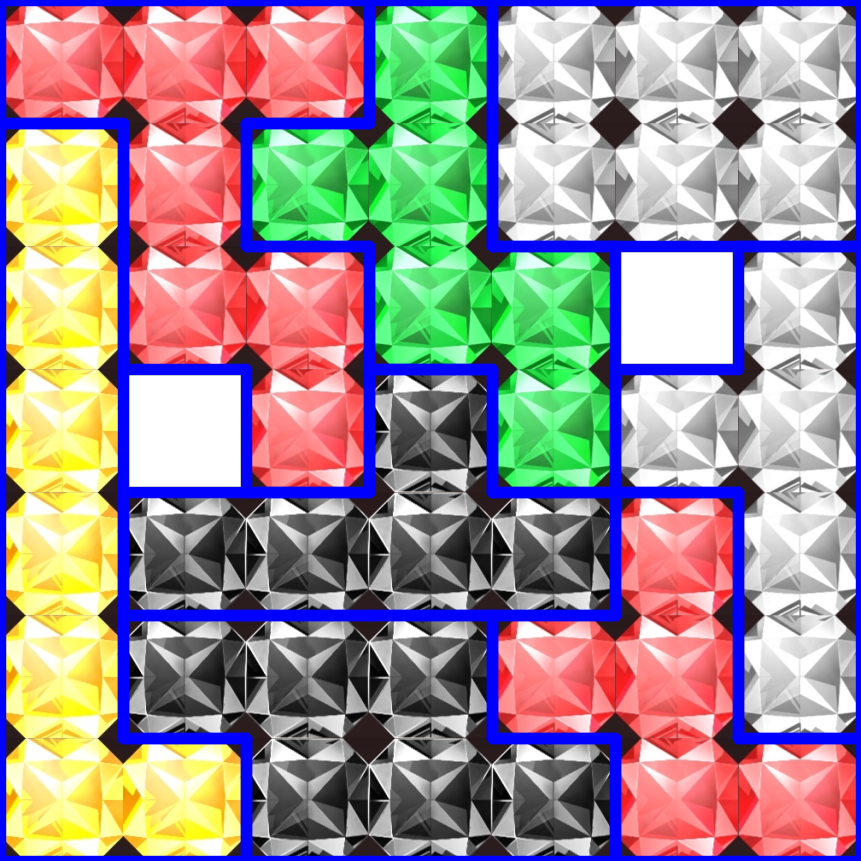
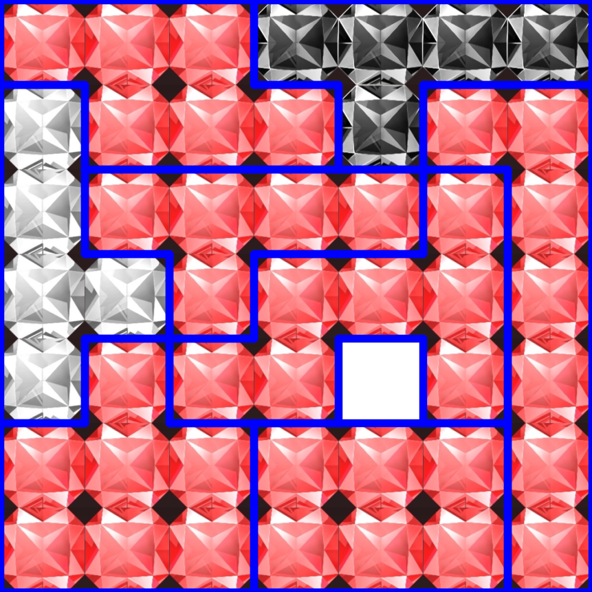

# Iruna Relic Solver

A lightweight solver for **Iruna Online relic / puzzle board layouts**.

This tool reads a puzzle definition file, searches valid 7x7 layouts, scores solutions based on a selected target attribute, and exports visualized solution images.

For Japanese documentation, see [README_ja.md](README_ja.md).

---

## Features

- Solves **7x7 relic puzzle layouts**
- Supports **piece rotation**
- Does **not** support piece flipping
- Supports attribute-based scoring:
  - `ATK`
  - `ASPD`
  - `VIT`
  - `MATK`
  - `SSPD`
  - `INT`
- Exports **image-based solutions**
- Sorts solutions by score automatically
- Users only need to edit **`relic_puzzles.txt`**

---

## Examples

Example output images:

### Example 1
- File: `solution_001_score5_rot270.png`
- Meaning: the best-ranked solution in this run scored **5**, and its best scoring orientation was **270°**



### Example 2
- File: `solution_001_score6_rot90.png`
- Meaning: the best-ranked solution in this run scored **6**, and its best scoring orientation was **90°**



These images are generated automatically by the solver and saved to `solutions_img/`.

---

## Project Structure

```text
iruna_relic/
├─ assets/
│  └─ tiles/
│     ├─ red.png
│     ├─ yellow.png
│     ├─ white.png
│     ├─ blue.png
│     ├─ green.png
│     └─ black.png
├─ relic_puzzles.txt
├─ relic_solver.py
├─ relic_solver.exe
├─ run.bat
├─ run.ps1
├─ pyproject.toml
└─ README.md
````

---

## Quick Start

### Option 1: Run the executable

1. Edit `relic_puzzles.txt`
2. Double-click `relic_solver.exe`
3. Wait for solving to finish
4. Check `solutions_img/`

### Option 2: Run with Python / uv

```bash
uv sync
uv run relic_solver.py
```

### Option 3: Run with helper scripts

* Double-click `run.bat`
* Or run `run.ps1` in PowerShell

---

## Puzzle File Format

All puzzle settings are defined in:

```text
relic_puzzles.txt
```

Example:

```text
# ===== Global Config =====
BOARD=7x7
TARGET=ATK

# ===== Pieces =====
[A]
name=Kaiser
color=black
shape:
AAAA
 A

[B]
name=Sauro
color=yellow
shape:
BBBBBB
B
```

---

## Available Settings

### BOARD

Currently expected to be:

```text
7x7
```

### TARGET

Supported values:

* `ATK`
* `ASPD`
* `VIT`
* `MATK`
* `SSPD`
* `INT`

### color

Supported values:

* `red`
* `yellow`
* `white`
* `blue`
* `green`
* `black`

---

## Output

Solved images are written to:

```text
solutions_img/
```

Example filename:

```text
solution_001_score5_rot90.png
```

Meaning:

* `001`: rank after sorting
* `score5`: total score
* `rot90`: best-scoring board rotation

---

## Rules

* Pieces may be rotated
* Pieces may not be flipped
* Solutions duplicated only by whole-board rotation are removed
* Solutions are scored and sorted by the selected target attribute
* Currently, score is calculated from **red pieces** placed on target cells

---

## Notes

* Missing tile images in `assets/tiles/` will prevent output generation
* Invalid puzzle file format may cause parse errors
* If the puzzle has no valid solution, no output image will be generated
* Large search spaces may take time

---

## Development Environment

This project uses:

* Python 3
* uv
* numpy
* opencv-python-headless

---

## License

This project is licensed under the MIT License. See [LICENSE](LICENSE).


---

# イルーナ レリック 配置ソルバー

**イルーナ戦記のレリッククリスタ配置**を解くための軽量ツールです。

このツールは、パズル定義ファイルを読み込み、7x7 盤面で有効な配置を探索し、指定したステータスに基づいてスコア計算を行い、解答を画像として出力します。

For English documentation, see [README.md](README.md).

---

## 主な機能

- **7x7 レリッククリスタ配置**の探索
- ピースの**回転**に対応
- ピースの**反転は非対応**
- 属性別スコア計算に対応
  - `ATK`
  - `ASPD`
  - `VIT`
  - `MATK`
  - `SSPD`
  - `INT`
- 解答を**画像形式**で出力
- スコア順に自動ソート
- ユーザーが編集するのは **`relic_puzzles.txt`** のみ

---

## 実行例

出力例は以下の通りです。

### 例1
- ファイル名: `solution_001_score5_rot270.png`
- 意味: この実行結果で最上位の解が **スコア5** を獲得し、**270度回転** の状態が最高得点だったことを示します


### 例2
- ファイル名: `solution_001_score6_rot90.png`
- 意味: この実行結果で最上位の解が **スコア6** を獲得し、**90度回転** の状態が最高得点だったことを示します


これらの画像はソルバーによって自動生成され、`solutions_img/` に保存されます。

---

## プロジェクト構成

```text
iruna_relic/
├─ assets/
│  └─ tiles/
│     ├─ red.png
│     ├─ yellow.png
│     ├─ white.png
│     ├─ blue.png
│     ├─ green.png
│     └─ black.png
├─ relic_puzzles.txt
├─ relic_solver.py
├─ relic_solver.exe
├─ run.bat
├─ run.ps1
├─ pyproject.toml
└─ README_ja.md
````

---

## 使い方

### 方法1：実行ファイルを使う

1. `relic_puzzles.txt` を編集する
2. `relic_solver.exe` をダブルクリックする
3. 計算完了まで待つ
4. `solutions_img/` を確認する

### 方法2：Python / uv で実行する

```bash
uv sync
uv run relic_solver.py
```

### 方法3：補助スクリプトで実行する

* `run.bat` をダブルクリック
* または PowerShell で `run.ps1` を実行

---

## パズル定義ファイル

すべての設定は以下のファイルに記述します。

```text
relic_puzzles.txt
```

例：

```text
# ===== Global Config =====
BOARD=7x7
TARGET=ATK

# ===== Pieces =====
[A]
name=Kaiser
color=black
shape:
AAAA
 A

[B]
name=Sauro
color=yellow
shape:
BBBBBB
B
```

---

## 設定可能項目

### BOARD

現在は以下を前提としています：

```text
7x7
```

### TARGET

指定可能な値：

* `ATK`
* `ASPD`
* `VIT`
* `MATK`
* `SSPD`
* `INT`

### color

指定可能な色：

* `red`
* `yellow`
* `white`
* `blue`
* `green`
* `black`

---

## 出力

解答画像は以下に出力されます：

```text
solutions_img/
```

出力ファイル名の例：

```text
solution_001_score5_rot90.png
```

意味：

* `001`：スコア順での順位
* `score5`：スコア 5
* `rot90`：90度回転時が最高得点

---

## ルール

* ピースは回転可能
* ピースの反転は不可
* 盤面全体の回転だけが異なる重複解は除外
* 指定した属性に基づいてスコア計算・ソート
* 現在のスコア計算は、**赤色ピース**が対象マスに置かれた数を基準としています

---

## 注意事項

* `assets/tiles/` に必要な画像がない場合、出力できません
* `relic_puzzles.txt` の形式が正しくない場合、解析に失敗します
* 解が存在しない場合、画像は出力されません
* 探索空間が大きい場合、計算に時間がかかることがあります

---

## 開発環境

このプロジェクトは以下を使用しています：

* Python 3
* uv
* numpy
* opencv-python-headless

---

## ライセンス

このプロジェクトは MIT License の下で公開されています。詳細は [LICENSE](LICENSE) を参照してください。